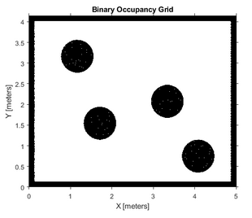

# ROBT403 HW3: Obstacle avoidance by a robot using ANN. 
The map was created by photoshop editor in png format and only then converted into pbm. I order to make the environment suitdul the map implemented by using navigator toolbox. However, the whole project is mainly done by Mobile Robotics Simulation Toolbox.


## Simulation setup
```MatLab
% Define vehicle
R = 0.1; % Wheel radius [m]
L = 0.3; % Wheelbase [m]
% dd = DifferentialDrive(R,L);
dd_robot = [R L];
% Sample time and time array
sampleTime = 0.01; % Sample time [s]
% Initial conditions
initPose = [0.5; 0.5; -pi/2]; % Initial pose (x y theta)
% Load map
close all
testmap = imread('test1.pbm');
map = robotics.BinaryOccupancyGrid(testmap, 200);
show(map)
```
## The Simulation Loop
```MatLab
idx = 1;
pose = initPose;
while((abs(waypoints(1)-initPose(1))>.1)||(abs(initPose(2)-waypoints(2))>.1))
 next_pose = [0; 0; 0];
 % concatenate next pose to the pose matrix
 pose = [pose next_pose];
 % calculate the direction to target
 % (degrees to understand easier)
 targetDir = rad2deg(atan2(waypoints(2)-initPose(2),...
 waypoints(1)-initPose(1)) - initPose(3));

 % make the direction circulat in -180 - 180 degrees
 if targetDir > 180
 targetDir = targetDir - 360;
 elseif targetDir < -180
 targetDir = 360 + targetDir;
 end
 % the direction angle is normalized between -0.5 and 0.5
 % in order to be able to impact the wheels differently
 % for steering to destination
 % so 0 is correct direction, no steering needed.
 targetDir = ((targetDir+180)/(2*180)) - 0.5;

 % inputs from sensor
 ranges = (lidar(initPose) - viz.robotRadius); % inputs in range 0 - 0.25m

 % normalize for ANN
 rangesN = (ranges+0.1)/0.4;

 % create ANN
 % inputs matrix --> [dir, CC, CR, CL, CRR, CLL]
 inputs = [targetDir, 1/rangesN(3), 1/rangesN(2),...
 1/rangesN(4), 1/rangesN(1), 1/rangesN(5)];
 % the sensor readings are collected to a matrix
 % and normalized between 0.1 and 1 and the inverse
 % is fed to the ANN to change NaN inputs to 0
 inputs (isnan(inputs)) = 0;

 % ANN
 weights = [-0.9, -0.15, 0, 0.35, 0, 0.5; % left wheel
 0.9, -0.15, 0.35, 0, 0.5, 0]; % right wheel
 bias = 0.2; % in order to have positive velocity
 activation = (weights * inputs.') + bias;
 leftWheel = activation(1)*30;
 rightWheel = activation(2)*30;

 % calc Forward Kinematics
 [v, y, w] = FK(dd_robot,leftWheel,rightWheel);
```
## Examples

### The initial pose is [0.5; 1.0; 0], and the final pose is [4.5; 3.2; pi/4].


### The initial pose is [1.5; 1.0; -pi/2], and the final pose is [4.5; 3.2; pi/4].


### The initial pose is [3.0; 0.4; -pi/4], and the final pose is [4.5; 3.2; pi/2].

